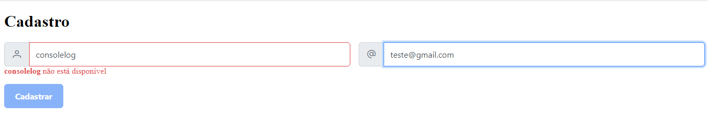
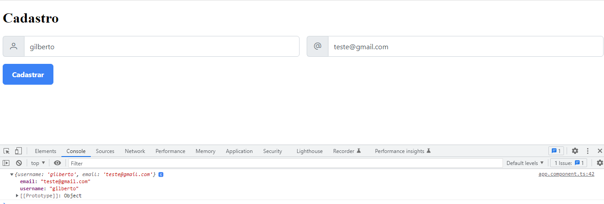
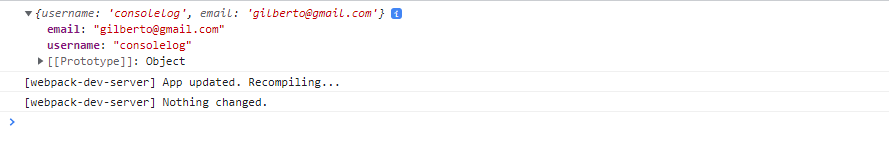

#  Validação assíncrona - AsyncValidatorFn Angular

Antes de submeter os dados para o servidor, é importante garantir que todos os dados que o usuário informou estão de acordo com os requisitos do seu negócio, ou seja, os dados são consistentes e atendem às políticas do negócio. Por esta razão, a validação no client-side é importante.

Nesta aplicação será abordado como podemos realizar validações assíncronas. Por exemplo, o usuário está preenchendo um formulário de cadastro, um dos campos é o username. Ao preencher este campo a aplicação deve validar se o username está disponível para uso através da consulta à uma API.

Para realizar esta tarefa, iremos explorar um pouco do Reactive Forms e o `AsyncValidatorFn` do Angular.


Neste projeto, iremos trabalhar com os componentes do `PrimeNG`. Para isso vamos adicionar os segintes pacotes.
```
npm install primeng
npm install primeicons
npm install primeflex
```

Utilizei o `"type": "module"` para indicar que o formato dos módulos será tratado como ES Modules. Por isto utilizei o `import` ao invés do require no arquivo `index.js`.

**Problema com CORS:** no meu ambiente de testes o frontend está rodando na porta 4200 e a API de validação na porta 3000. Neste caso vamos ter problemas de Cross-Origin Resouce Sharing (CORS), então para efetuar um `bypass` no seu navegador utilize uma das opções abaixo, lembrando que isto deve ser feito somente em ambiente de desenvolvimento:

- Chrome Windows: execute-o utilizando a seguinte opção:    
    `C:\Program Files\Google\Chrome\Application\chrome.exe --disable-web-security --disable-gpu --user-data-dir=C:\temp\chromeTemp`
- Chrome macOS:    
    `open -n -a /Applications/Google\ Chrome.app/Contents/MacOS/Google\ Chrome --args --user-data-dir="/tmp/chrome_dev_test" --disable-web-securit`
- Safari:    
    vá até a aba Developer e selecione a opção `Disable Cross-Origin Restrictions`

## ScreenShots da Aplicação funcionando
<p align="center">

</p>

## 
<p align="center">

</p>

## 
<p align="center">

</p>


<h1 align="center">💻 Desenvolvido Por: Gilberto Júnior</h1>